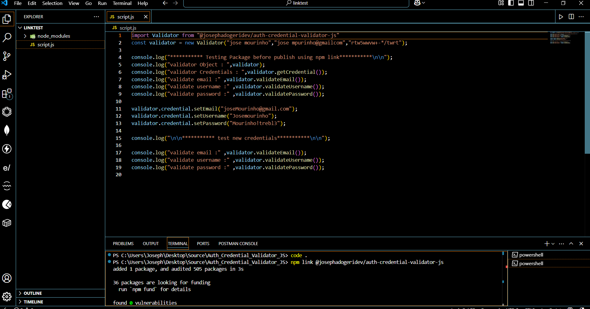
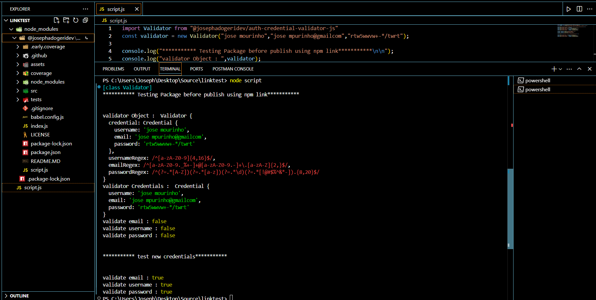

# **Auth Credential Validator JS**

**Version:** 1.0.0
**Date:** June 2, 2025

---

## Description

This is a javascript npm package for both frontend and Backend Application (Express + Node + Mongoose) which validate credentials (username, email password) using dynamic regex field.

## Authors

[@jadogeri](https://www.github.com/jadogeri)

## Repository

 [https://github.com/jadogeri/Auth-Credential-Validator-JS.git](https://github.com/jadogeri/Auth-Credential-Validator-JS.git)

 ## Registory

npm : [@josephadogeridev/auth-credential-validator-js](https://www.npmjs.com/package/@josephadogeridev/auth-credential-validator-js)


## Screenshots

|  |  |
| -------------------------------------------- | -------------------------------------------- |
|                                              |                                              |

## Table of Contents

<ul>
      <li><a href="#1-introduction">1. Introduction</a>
        <ul>
          <li><a href="#11-purpose">1.1 Purpose</a> </li>
          <li><a href="#12-scope">1.2 Scope</a> </li>
          <li><a href="#13-intended-audience">1.3 Intended Audience</a> </li>
        </ul>
      </li>
    </ul>
    <ul>
      <li><a href="#2-technology-stack">2. Technology Stack</a>
      </li>
    </ul>
    <ul>
      <li><a href="#3-data-design">3. Data Design</a>
        <ul>
          <li><a href="#31-data-entities-and-relationships">3.1 Entities and Relationships</a> </li>
        </ul>
      </li>
    </ul> 
    <ul>
        <li><a href="#4-usage">4. Usage</a> </li>
        <ul>
            <li><a href="#41-install-dependency">4.1 Install Dependency</a> </li>
            <li><a href="#42-code-snippet">4.2 Code Snippet</a> </li>
        </ul>
    </ul> 
    <ul>
        <li><a href="#5-tests-">5. Tests</a> </li>
        <ul>
            <li><a href="#51-test-from-node_modules">5.1 Test from node_modules</a> </li>
            <li><a href="#52-test-from-npm-link">5.2 Test from npm link</a> </li>
        </ul>
    </ul> 
    <ul>  
        <li><a href="#6-license">6. License</a>
        </li>
    </ul> 
    <ul> 
        <li><a href="#7-references">7. References</a>
        </li>
    <ul>

## **1. Introduction**

### **1.1 Purpose**

This document outlines the system architecture, components, and design considerations for Contact Management App. The goal is to provide a template for backend developers to handle CRUD operations and authentication flow.

### **1.2 Scope**

This package will allow users to:

- Accept valid credentials (username, email and password).
- Resolve undefined and undefined values as inputs.
- Provide security to user data.

### **1.3 Intended Audience**

- Junior or Senior backend developers.
- beginners learning typescript.

---

### **2. Technology Stack**

- **Programming Languages**: Javascript
- **IDE**: Visual Studio Code (VSCode)
- **Test**: Jest
- **Plugins**: Early AI
- **Hosting**: Render.com
- **Source Control**: Git and GitHub
- **CI/CD**: GitHub Actions
- **Code Analsis**: SonarQube

## **3. Data Design**

### **3.1 Data Entities and Relationships**

| Entity | Description                                          |
| ------ | ---------------------------------------------------- |
| CREDENTIAL   | User account information used to authenticate users. |
| VALIDATOR  | Validates authentication information of Users.           |

---

## **4. Usage**

### 4.1 install dependency ###

1 Type npm install auth-credential-validator-js install dependencies.

```bash
  npm install auth-credential-validator-js
```
### 4.2 Classes and Methods ###

This project includes the following core components:

#### 4.2.1 `Credential` Class ####

The `Credential` class represents a single credential with its attributes and methods.

*   **Attributes:**
    *   `username` (string): The username of the credential.
    *   `email` (string): The email of the credential.
    *   `password` (string): The password of the credential.
*   **Methods:**
    *   `constructor(username ,email ,password)`: The constructor method to initialize a new `Credential` object.
        *   **Parameters:**
            *   `username` (string): The username of the credential.
            *   `email` (string): The email of the credential.
            *   `password` (string): The password of the credential.
        *   **Description:** Creates a new `Credential` instance with the provided username, email, and password.
    *   `getUsername()`: Returns a string containing the credential's username.
        *   **Description:** Retrieves the username as a readable string.
    *   `getEmail()`: Returns a string containing the credential's email.
        *   **Description:** Retrieves the email as a readable string.
    *   `getPassword()`: Returns a string containing the credential's password.
        *   **Description:** Retrieves the password as a readable string.
    *   `setUsername(username)`: Returns a string containing the credential's username.
        *   **Parameters:**
            *   `username` (`string` ): The new username of a credential.
        *   **Description:** updates the username of the credential object.
    *   `setEmail(email)`: Returns a string containing the credential's email.
        *   **Parameters:**
            *   `email` (`string` ): The new email of a credential.
        *   **Description:** updates the email of the credential object.
    *   `setPassword(password)`: Returns a string containing the credential's password.
        *   **Parameters:**
            *   `password` (`string` ): The new password of a credential.
        *   **Description:** updates the password of the credential object.

#### 4.2.2 `Validator` Class ####

The `Validator` class represents a single validator with its attributes and methods.

*   **Attributes:**
    *   `username` (string): The username of the credential.
    *   `email` (string): The email of the credential.
    *   `password` (string): The password of the credential.
*   **Methods:**
    *   `constructor(username ,email ,password)`: The constructor method to initialize a new `Credential` object.
        *   **Parameters:**
            *   `username` (string): The username of the credential.
            *   `email` (string): The email of the credential.
            *   `password` (string): The password of the credential.
        *   **Description:** Creates a new `Credential` instance with the provided username, email, and password.
    *   `getUsername()`: Returns a string containing the credential's username.
        *   **Description:** Retrieves the username as a readable string.
    *   `getEmail()`: Returns a string containing the credential's email.
        *   **Description:** Retrieves the email as a readable string.
    *   `getPassword()`: Returns a string containing the credential's password.
        *   **Description:** Retrieves the password as a readable string.
    *   `setUsername(username)`: Returns a string containing the credential's username.
        *   **Parameters:**
            *   `username` (`string` ): The new username of a credential.
        *   **Description:** updates the username of the credential object.
    *   `setEmail(email)`: Returns a string containing the credential's email.
        *   **Parameters:**
            *   `email` (`string` ): The new email of a credential.
        *   **Description:** updates the email of the credential object.
    *   `setPassword(password)`: Returns a string containing the credential's password.
        *   **Parameters:**
            *   `password` (`string` ): The new password of a credential.
        *   **Description:** updates the password of the credential object.

### 4.3 code snippet ###

```ruby

import Validator from "auth-credential-validator-js"
const validator = new Validator("jose mourinho","jose mpurinho@gmailcom","rtw5wwvw+-*/twrt");

console.log("*********** Testing Package before publish using npm link***********\n\n");
console.log("validator Object : ",validator);
console.log("validator Credentials : ",validator.getCredential());
console.log("validate email :" ,validator.validateEmail());
console.log("validate username :" ,validator.validateUsername());
console.log("validate password :" ,validator.validatePassword());

validator.credential.setEmail("joseMourinho@gmail.com");
validator.credential.setUsername("Josemourinho");
validator.credential.setPassword("Mourinho!trebl3");

console.log("\n\n*********** test new credentials***********\n\n");

console.log("validate email :" ,validator.validateEmail());
console.log("validate username :" ,validator.validateUsername());
console.log("validate password :" ,validator.validatePassword());

```


## 5. Tests  ##

#### **5.1 Test from node_modules**

1 navigate to cd @josephadogeridev/auth-credential-validator-js directory using command below

```bash
  cd node_modules/@josephadogeridev/auth-credential-validator-js  
```

2 type npm run test to run unit tests

```bash
  npm run test
```


#### **5.2 Test from npm link**

Note : this test was done pre publish to npm manager

1 In the root of package run npm link to create symblink globally accessible

```bash
  npm link
```


2 Create a new directory, copy script.js in Auth-Credential-Validator-JS root directory to new folder.

3 Run command nom link Auth-Credential-Validator-JS to install node with created package



3 Type node script.js to test package

```bash
  code script.js
```



## **6. License**

[LICENSE](/LICENSE)

---

## **7. References**

* FreeCodeCamp : [Frontend Web Development: (HTML, CSS, JavaScript, TypeScript, React)](https://www.youtube.com/watch?v=MsnQ5uepIa).
* AweSome Open Source : [Awesome Readme Templates](https://awesomeopensource.com/project/elangosundar/awesome-README-templates)
* Readme.so : [The easiest way to create a README](https://readme.so/)
* Mockingoose : [How to test mongoose models with jest and mockingoose](https://dev.to/darkmavis1980/how-to-test-mongoose-models-with-jest-and-mockingoose-2k10)


# My Awesome Project

## Overview

This project provides a simple Python library for managing a collection of books. It utilizes object-oriented principles to represent books and their associated operations.

## Classes and Methods

This project includes the following core components:

### `Book` Class

The `Book` class represents a single book with its attributes and methods.

*   **Attributes:**
    *   `title` (string): The title of the book.
    *   `author` (string): The author of the book.
    *   `isbn` (string): The ISBN of the book.

*   **Methods:**
    *   `__init__(self, title, author, isbn)`: The constructor method to initialize a new `Book` object.
        *   **Parameters:**
            *   `title` (string): The title of the book.
            *   `author` (string): The author of the book.
            *   `isbn` (string): The ISBN of the book.
        *   **Description:** Creates a new `Book` instance with the provided title, author, and ISBN.
    *   `get_details(self)`: Returns a formatted string containing the book's details.
        *   **Description:** Retrieves the title, author, and ISBN and formats them into a readable string.

### `Library` Class

The `Library` class manages a collection of `Book` objects.

*   **Attributes:**
    *   `books` (list): A list containing `Book` objects.

*   **Methods:**
    *   `__init__(self)`: The constructor method to initialize a new `Library` object.
        *   **Description:** Creates an empty list to store books.
    *   `add_book(self, book)`: Adds a `Book` object to the library.
        *   **Parameters:**
            *   `book` (`Book` object): The book to be added to the library.
        *   **Description:** Appends the provided `Book` object to the internal list of books.
    *   `list_books(self)`: Prints the details of all books in the library.
        *   **Description:** Iterates through the list of books and prints the details of each book using the `get_details()` method of the `Book` class.


